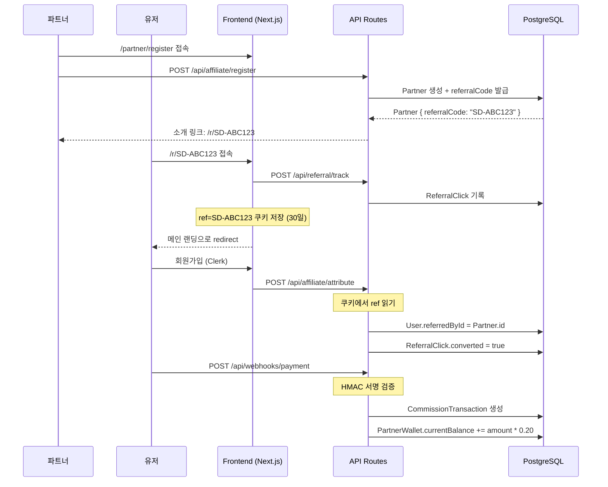

# [Design] affiliate-system

| 항목 | 내용 |
|------|------|
| **Feature** | affiliate-system |
| **작성일** | 2026-02-18 |
| **Phase** | Design |
| **참조** | `docs/01-plan/features/affiliate-system.plan.md` |

---

## 1. 전체 플로우 다이어그램



---

## 2. DB 스키마 상세 설계

### 2.1 기존 schema.prisma에 추가할 내용

```prisma
// 파트너
model Partner {
  id           String        @id @default(cuid())
  clerkUserId  String        @unique  // Clerk User ID
  referralCode String        @unique  // "SD-" + nanoid(6)
  name         String
  email        String        @unique
  phone        String?
  bio          String?       @db.Text
  status       PartnerStatus @default(PENDING)
  createdAt    DateTime      @default(now())
  updatedAt    DateTime      @updatedAt

  wallet       PartnerWallet?
  referredUsers ReferredUser[]
  clicks       ReferralClick[]

  @@map("partners")
}

// 파트너 지갑
model PartnerWallet {
  id             String   @id @default(cuid())
  partnerId      String   @unique
  partner        Partner  @relation(fields: [partnerId], references: [id])
  currentBalance Float    @default(0)   // 출금 가능 잔액
  totalEarned    Float    @default(0)   // 누적 수익
  pendingAmount  Float    @default(0)   // 정산 대기 중
  createdAt      DateTime @default(now())
  updatedAt      DateTime @updatedAt

  transactions   CommissionTransaction[]
  settlements    Settlement[]

  @@map("partner_wallets")
}

// 귀속된 유저 (파트너 → 유저 연결)
model ReferredUser {
  id          String   @id @default(cuid())
  partnerId   String
  partner     Partner  @relation(fields: [partnerId], references: [id])
  clerkUserId String   @unique  // 가입한 유저의 Clerk ID
  email       String
  createdAt   DateTime @default(now())

  transactions CommissionTransaction[]

  @@map("referred_users")
}

// 클릭 추적
model ReferralClick {
  id          String   @id @default(cuid())
  partnerId   String
  partner     Partner  @relation(fields: [partnerId], references: [id])
  ipAddress   String?
  userAgent   String?
  converted   Boolean  @default(false)  // 가입 전환 여부
  convertedAt DateTime?
  createdAt   DateTime @default(now())

  @@map("referral_clicks")
}

// 수수료 거래 내역
model CommissionTransaction {
  id               String            @id @default(cuid())
  walletId         String
  wallet           PartnerWallet     @relation(fields: [walletId], references: [id])
  referredUserId   String
  referredUser     ReferredUser      @relation(fields: [referredUserId], references: [id])
  serviceId        String            // SaaS 서비스 ID
  serviceName      String            // SaaS 서비스명
  paymentAmount    Float             // 원결제 금액
  commissionRate   Float             @default(0.20)
  commissionAmount Float             // 수수료 금액
  status           CommissionStatus  @default(PENDING)
  webhookPayload   Json?             // 원본 webhook 데이터
  createdAt        DateTime          @default(now())
  updatedAt        DateTime          @updatedAt

  @@map("commission_transactions")
}

// 정산 신청
model Settlement {
  id           String           @id @default(cuid())
  walletId     String
  wallet       PartnerWallet    @relation(fields: [walletId], references: [id])
  amount       Float            // 정산 신청 금액
  bankName     String
  accountNumber String
  accountHolder String
  status       SettlementStatus @default(REQUESTED)
  memo         String?          @db.Text
  processedAt  DateTime?
  createdAt    DateTime         @default(now())
  updatedAt    DateTime         @updatedAt

  @@map("settlements")
}

// Enums
enum PartnerStatus {
  PENDING    // 승인 대기
  ACTIVE     // 활성
  SUSPENDED  // 정지
}

enum CommissionStatus {
  PENDING    // 적립 대기
  CONFIRMED  // 확정
  PAID       // 지급 완료
}

enum SettlementStatus {
  REQUESTED  // 신청
  PROCESSING // 처리 중
  COMPLETED  // 완료
  REJECTED   // 반려
}
```

---

## 3. API 상세 스펙

### 3.1 파트너 신청
```
POST /api/affiliate/register
Auth: Clerk (로그인 필요)

Request Body:
{
  "name": "홍길동",
  "phone": "010-1234-5678",
  "bio": "저는 마케터입니다..."
}

Response 201:
{
  "success": true,
  "data": {
    "id": "clx...",
    "referralCode": "SD-ABC123",
    "referralUrl": "https://socialdoctors.com/r/SD-ABC123",
    "status": "PENDING"
  }
}
```

### 3.2 클릭 추적 (공개 API)
```
POST /api/referral/track
Auth: 없음 (공개)

Request Body:
{
  "referralCode": "SD-ABC123",
  "userAgent": "Mozilla/5.0..."
}

Response 200:
{
  "success": true,
  "redirectUrl": "/"
}

Side Effect:
- ReferralClick DB 저장
- Set-Cookie: ref=SD-ABC123; Max-Age=2592000; HttpOnly; SameSite=Lax
```

### 3.3 회원가입 귀속
```
POST /api/affiliate/attribute
Auth: Clerk (신규 가입 직후 호출)

Request Body:
{
  "referralCode": "SD-ABC123"  // 쿠키에서 읽음
}

Response 200:
{
  "success": true,
  "attributed": true
}
```

### 3.4 파트너 대시보드 데이터
```
GET /api/affiliate/dashboard
Auth: Clerk (파트너 본인)

Response 200:
{
  "success": true,
  "data": {
    "partner": {
      "id": "...",
      "referralCode": "SD-ABC123",
      "referralUrl": "https://...",
      "status": "ACTIVE"
    },
    "stats": {
      "totalClicks": 142,
      "totalSignups": 23,
      "conversionRate": 16.2,
      "totalEarned": 180000,
      "currentBalance": 120000,
      "pendingAmount": 60000
    },
    "recentTransactions": [...],  // 최근 10건
    "clicksChart": [              // 최근 30일 일별 클릭
      { "date": "2026-01-20", "clicks": 5, "signups": 1 }
    ]
  }
}
```

### 3.5 결제 Webhook
```
POST /api/webhooks/payment
Auth: HMAC-SHA256 서명 검증 (X-Webhook-Signature 헤더)

Request Body:
{
  "event": "payment.completed",
  "serviceId": "saas-product-id",
  "serviceName": "Social Pulse",
  "userId": "clerk_user_id",
  "amount": 50000,
  "currency": "KRW",
  "paidAt": "2026-02-18T10:00:00Z"
}

Logic:
1. HMAC 서명 검증
2. ReferredUser 조회 (userId 기준)
3. 파트너 조회
4. CommissionTransaction 생성 (amount * 0.20)
5. PartnerWallet.currentBalance, totalEarned 업데이트 (트랜잭션)

Response 200:
{
  "success": true,
  "commissionAmount": 10000
}
```

### 3.6 정산 신청
```
POST /api/affiliate/settlement
Auth: Clerk (파트너 본인)

Request Body:
{
  "amount": 100000,
  "bankName": "국민은행",
  "accountNumber": "123-456-789012",
  "accountHolder": "홍길동"
}

Validation:
- amount <= currentBalance
- amount >= 50000 (최소 정산액)

Response 201:
{
  "success": true,
  "data": { "id": "...", "status": "REQUESTED" }
}
```

---

## 4. 파일/컴포넌트 구조 상세

```
frontend/
├── app/
│   ├── r/
│   │   └── [code]/
│   │       └── route.ts          ← 리다이렉트 + 쿠키 설정 (Route Handler)
│   ├── partner/
│   │   ├── layout.tsx            ← 파트너 섹션 레이아웃
│   │   ├── page.tsx              ← 파트너 소개/가입 CTA
│   │   ├── register/
│   │   │   └── page.tsx          ← 파트너 신청 폼
│   │   └── dashboard/
│   │       └── page.tsx          ← 파트너 대시보드
│   ├── admin/
│   │   ├── page.tsx              ← 기존 (SaaS 관리)
│   │   ├── partners/
│   │   │   └── page.tsx          ← 파트너 목록/승인 관리
│   │   └── settlements/
│   │       └── page.tsx          ← 정산 신청 관리
│   └── api/
│       ├── affiliate/
│       │   ├── register/route.ts
│       │   ├── dashboard/route.ts
│       │   ├── attribute/route.ts
│       │   ├── commissions/route.ts
│       │   └── settlement/route.ts
│       ├── referral/
│       │   └── track/route.ts
│       └── webhooks/
│           └── payment/route.ts
├── components/
│   ├── partner/
│   │   ├── PartnerRegisterForm.tsx   ← 파트너 신청 폼
│   │   ├── PartnerDashboard.tsx      ← 대시보드 메인
│   │   ├── StatsCard.tsx             ← KPI 카드 (클릭/가입/수익)
│   │   ├── ClicksChart.tsx           ← 클릭 추세 차트 (recharts)
│   │   ├── TransactionList.tsx       ← 수수료 내역 테이블
│   │   ├── ReferralLinkBox.tsx       ← 소개 링크 복사 UI
│   │   └── SettlementForm.tsx        ← 정산 신청 폼
│   └── PartnersSection.tsx           ← 기존 (파트너 소개 랜딩 섹션)
└── lib/
    ├── prisma.ts                 ← 기존
    ├── saas-store.ts             ← 기존
    ├── referral.ts               ← referralCode 생성 유틸
    └── webhook.ts                ← HMAC 서명 검증 유틸
```

---

## 5. 핵심 로직 설계

### 5.1 referralCode 생성
```typescript
// lib/referral.ts
import { customAlphabet } from 'nanoid';

const nanoid = customAlphabet('ABCDEFGHIJKLMNOPQRSTUVWXYZ0123456789', 6);

export function generateReferralCode(): string {
  return 'SD-' + nanoid(); // 예: SD-ABC123
}

export function getReferralCodeFromCookie(cookieHeader: string): string | null {
  const match = cookieHeader.match(/ref=([^;]+)/);
  return match ? match[1] : null;
}
```

### 5.2 소개 링크 리다이렉트 (Route Handler)
```typescript
// app/r/[code]/route.ts
import { NextRequest, NextResponse } from 'next/server';

export async function GET(
  request: NextRequest,
  { params }: { params: { code: string } }
) {
  const { code } = params;

  // 클릭 추적 API 호출
  await fetch(`${request.nextUrl.origin}/api/referral/track`, {
    method: 'POST',
    body: JSON.stringify({
      referralCode: code,
      userAgent: request.headers.get('user-agent'),
    }),
  });

  // 쿠키 설정 + 메인으로 리다이렉트
  const response = NextResponse.redirect(new URL('/', request.url));
  response.cookies.set('ref', code, {
    maxAge: 60 * 60 * 24 * 30, // 30일
    httpOnly: true,
    sameSite: 'lax',
    path: '/',
  });
  return response;
}
```

### 5.3 Webhook HMAC 검증
```typescript
// lib/webhook.ts
import crypto from 'crypto';

export function verifyWebhookSignature(
  payload: string,
  signature: string,
  secret: string
): boolean {
  const expected = crypto
    .createHmac('sha256', secret)
    .update(payload)
    .digest('hex');
  return crypto.timingSafeEqual(
    Buffer.from(signature),
    Buffer.from(expected)
  );
}
```

### 5.4 수수료 적립 트랜잭션
```typescript
// api/webhooks/payment/route.ts 내부 로직
await prisma.$transaction(async (tx) => {
  // 1. 귀속 유저 조회
  const referredUser = await tx.referredUser.findUnique({
    where: { clerkUserId: userId },
    include: { partner: { include: { wallet: true } } },
  });
  if (!referredUser) return; // 귀속된 파트너 없으면 종료

  const commissionAmount = paymentAmount * 0.20;

  // 2. 수수료 거래 내역 생성
  await tx.commissionTransaction.create({
    data: {
      walletId: referredUser.partner.wallet.id,
      referredUserId: referredUser.id,
      serviceId,
      serviceName,
      paymentAmount,
      commissionAmount,
      status: 'CONFIRMED',
    },
  });

  // 3. 지갑 잔액 업데이트
  await tx.partnerWallet.update({
    where: { id: referredUser.partner.wallet.id },
    data: {
      currentBalance: { increment: commissionAmount },
      totalEarned: { increment: commissionAmount },
    },
  });
});
```

---

## 6. UI/UX 설계

### 6.1 파트너 대시보드 레이아웃
```
┌─────────────────────────────────────────────────────────┐
│  [SocialDoctors]              파트너 대시보드  [로그아웃] │
├─────────────────────────────────────────────────────────┤
│                                                         │
│  내 소개 링크: https://socialdoctors.com/r/SD-ABC123    │
│  [복사] [공유]                                           │
│                                                         │
├────────────┬────────────┬────────────┬────────────────-─┤
│ 총 클릭    │ 총 가입    │ 전환율     │ 총 수익         │
│   142      │   23명     │  16.2%     │ ₩180,000        │
├────────────┴────────────┴────────────┴─────────────────┤
│                                                         │
│  [최근 30일 클릭/가입 차트 - recharts LineChart]        │
│                                                         │
├─────────────────────────────────────────────────────────┤
│  출금 가능: ₩120,000        [정산 신청]                  │
│  정산 대기: ₩60,000                                     │
├─────────────────────────────────────────────────────────┤
│  최근 수수료 내역                                        │
│  날짜        서비스       결제액     수수료   상태       │
│  2026-02-17  Social Pulse ₩50,000  ₩10,000  확정       │
│  ...                                                    │
└─────────────────────────────────────────────────────────┘
```

### 6.2 색상 및 스타일
- Salesforce Blue `#00A1E0` — 주요 CTA, 강조
- 배경 `#F3F2F2`
- 텍스트 `#16325C`
- Tailwind CSS + Shadcn/ui Card, Table, Button
- 차트: `recharts` (설치 필요)

---

## 7. 환경변수 추가 필요

```env
# .env.local (기존에 추가)
DATABASE_URL=postgresql://...       # 기존
WEBHOOK_SECRET=your-webhook-secret  # 신규: Webhook HMAC 서명 키
NEXT_PUBLIC_BASE_URL=https://socialdoctors.34.64.143.114.nip.io  # 신규
```

---

## 8. 패키지 설치 필요

```bash
cd frontend
npm install nanoid recharts
npm install -D @types/recharts
```

---

## 9. 구현 순서 (Do Phase 참고용)

| 순서 | 작업 | 파일 |
|------|------|------|
| 1 | Prisma 스키마 추가 + 마이그레이션 | `prisma/schema.prisma` |
| 2 | referral.ts, webhook.ts 유틸 | `frontend/lib/` |
| 3 | 소개 링크 리다이렉트 Route Handler | `app/r/[code]/route.ts` |
| 4 | 파트너 신청 API | `app/api/affiliate/register/route.ts` |
| 5 | 클릭 추적 API | `app/api/referral/track/route.ts` |
| 6 | 회원가입 귀속 API | `app/api/affiliate/attribute/route.ts` |
| 7 | Webhook 수신 API | `app/api/webhooks/payment/route.ts` |
| 8 | 대시보드 데이터 API | `app/api/affiliate/dashboard/route.ts` |
| 9 | 정산 신청 API | `app/api/affiliate/settlement/route.ts` |
| 10 | 파트너 신청 페이지 + 폼 | `app/partner/register/` |
| 11 | 파트너 대시보드 페이지 | `app/partner/dashboard/` |
| 12 | 어드민 파트너 관리 | `app/admin/partners/` |
| 13 | middleware.ts 공개 라우트 추가 | `middleware.ts` |
