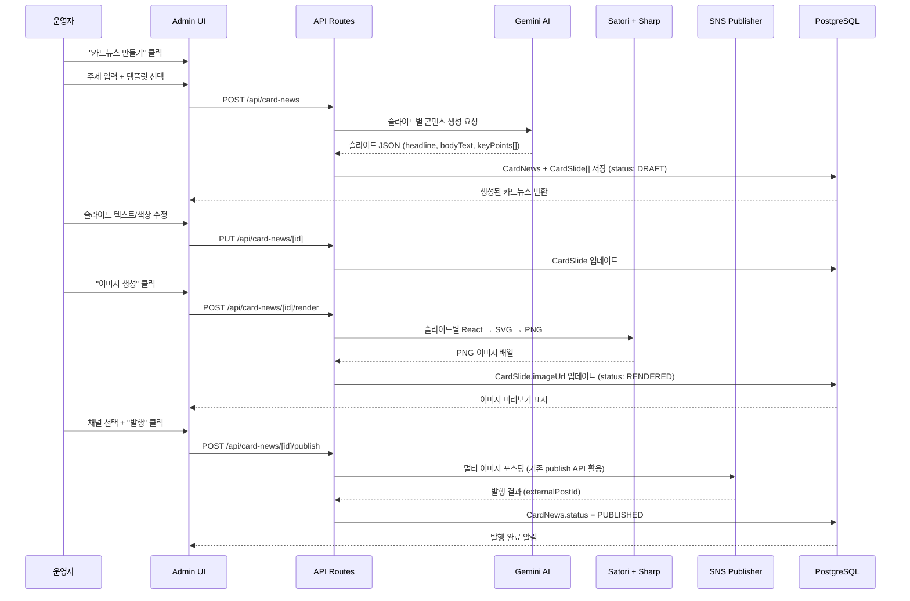
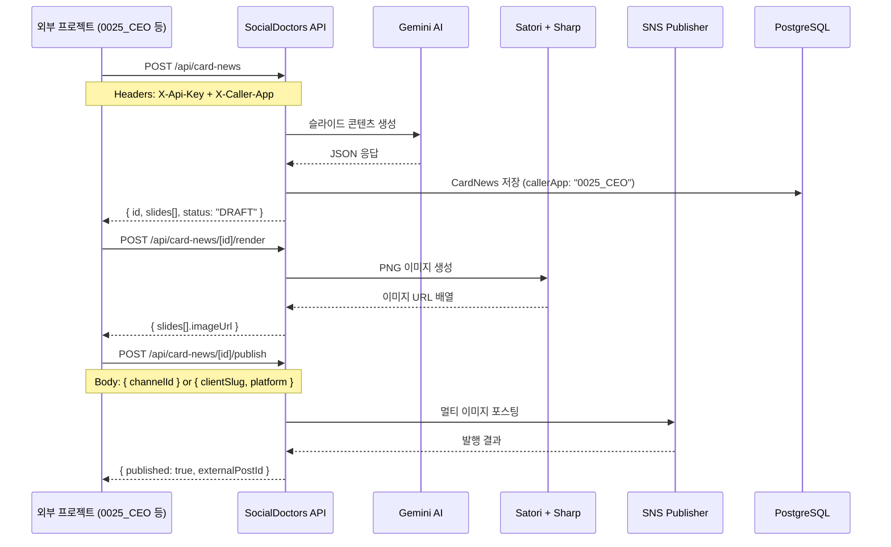

# [Design] card-news

| 항목 | 내용 |
|------|------|
| **Feature** | card-news (AI 카드뉴스 자동 생성) |
| **작성일** | 2026-03-17 |
| **Phase** | Design |
| **참조** | `docs/01-plan/features/card-news.plan.md` |

---

## 1. 전체 플로우 다이어그램

### 1.1 카드뉴스 생성 → 발행 플로우



### 1.2 외부 프로젝트 연동 플로우 (Cross-Project API)



---

## 2. 외부 프로젝트 연동 시나리오

### 시나리오 A: 0025_CEO에서 광고 캠페인용 카드뉴스 생성

```
[0025_CEO 프로젝트]
  CEO 대시보드에서 "광고 콘텐츠 생성" 클릭
    ↓
  주제: "타운인 봄맞이 이벤트"
  템플릿: EVENT (3슬라이드)
  채널: 타운인 Facebook
    ↓
  0025_CEO → SocialDoctors API 호출:
    POST https://app.socialdoctors.kr/api/card-news
    Headers:
      X-Api-Key: {SOCIAL_PULSE_API_KEY}
      X-Caller-App: "0025_CEO"
    Body:
      {
        "topic": "타운인 봄맞이 커뮤니티 이벤트",
        "templateType": "EVENT",
        "brandColor": "#FF6B35",
        "logoUrl": "https://townin.kr/logo.png",
        "clientSlug": "townin"
      }
    ↓
  SocialDoctors AI가 3슬라이드 콘텐츠 생성
    ↓
  0025_CEO → 이미지 렌더링 요청:
    POST /api/card-news/{id}/render
    ↓
  PNG 이미지 3장 URL 반환
    ↓
  0025_CEO 대시보드에서 미리보기 확인
    ↓
  0025_CEO → 발행 요청:
    POST /api/card-news/{id}/publish
    Body: { "clientSlug": "townin", "platform": "FACEBOOK" }
    ↓
  타운인 Facebook 페이지에 카드뉴스 자동 발행
    ↓
  0025_CEO 대시보드에 발행 결과 표시
```

### 시나리오 B: InsureGraph Pro에서 보험 콘텐츠 카드뉴스

```
[InsureGraph Pro 프로젝트]
  "보험 약관 비교" 분석 결과 생성 완료
    ↓
  "SNS 공유" 버튼 클릭
    ↓
  InsureGraph → SocialDoctors API 호출:
    POST /api/card-news
    Headers: X-Api-Key, X-Caller-App: "insure-graph"
    Body:
      {
        "topic": "자동차보험 갱신 전 꼭 확인할 3가지",
        "templateType": "EDUCATION",
        "slides": [   ← 사전 정의 콘텐츠 (AI 생략 가능)
          { "headline": "보험료 20% 절약하는 법", "bodyText": "..." },
          ...
        ]
      }
    ↓
  이미지 렌더링 → 자동 발행 (원스텝)
    POST /api/card-news/{id}/render-and-publish
    Body: { "channelId": "insure-graph-fb-channel-id" }
    ↓
  InsureGraph Pro 대시보드에 공유 완료 표시
```

### 시나리오 C: CertiGraph에서 합격 축하 카드뉴스

```
[CertiGraph 프로젝트]
  사용자가 모의시험 만점 달성
    ↓
  이벤트 트리거 → SocialDoctors API 자동 호출:
    POST /api/card-news
    Headers: X-Caller-App: "certi-graph"
    Body:
      {
        "topic": "정보처리기사 합격 비결 공개!",
        "templateType": "SERVICE_INTRO",
        "autoPublish": true,
        "publishTo": { "clientSlug": "certigraph", "platform": "FACEBOOK" }
      }
    ↓
  AI 콘텐츠 생성 → 렌더링 → 자동 발행 (전자동)
    ↓
  CertiGraph 공식 페이지에 합격 축하 카드뉴스 발행
```

### 연동 API 인증 방식 (기존 패턴 활용)

```
인증 헤더:
  X-Api-Key: {SOCIAL_PULSE_API_KEY}    ← 기존 키 공유 또는 프로젝트별 발급
  X-Caller-App: "0025_CEO" | "insure-graph" | "certi-graph" | ...

인증 검증 (lib/api-auth.ts의 resolveAuth() 활용):
  1. 세션 인증 (Admin UI) → session.user 반환
  2. API Key 인증 (외부) → { apiKey: true, callerApp: "..." } 반환
  3. 둘 다 없음 → 401 Unauthorized
```

---

## 3. DB 스키마 상세 설계

### 3.1 신규 모델 추가 (schema.prisma)

```prisma
// ─── 카드뉴스 ───────────────────────────────────────

model CardNews {
  id            String          @id @default(cuid())
  title         String          // 카드뉴스 제목 (예: "CertiGraph AI 학습 플래너 소개")
  topic         String          // AI 생성용 주제 입력값
  templateType  CardTemplate    @default(SERVICE_INTRO)
  slideCount    Int             // 슬라이드 수
  status        CardNewsStatus  @default(DRAFT)

  // 브랜드 설정
  brandColor    String?         // 메인 컬러 (예: "#00A1E0")
  subColor      String?         // 보조 컬러
  logoUrl       String?         // 브랜드 로고 URL
  fontFamily    String?         @default("Noto Sans KR") // 폰트

  // 연관 관계
  channelId     String?         // 발행 대상 SNS 채널
  channel       SnsChannel?     @relation(fields: [channelId], references: [id])
  postId        String?         // 발행된 SocialPost ID
  post          SocialPost?     @relation(fields: [postId], references: [id])
  slides        CardSlide[]

  // 생성자 추적
  createdBy     String?         // 세션 유저 ID 또는 null
  callerApp     String?         // 외부 호출 앱 (예: "0025_CEO")

  // 타임스탬프
  createdAt     DateTime        @default(now())
  updatedAt     DateTime        @updatedAt
  publishedAt   DateTime?

  @@index([status])
  @@index([callerApp])
  @@index([channelId])
}

model CardSlide {
  id            String    @id @default(cuid())
  cardNewsId    String
  cardNews      CardNews  @relation(fields: [cardNewsId], references: [id], onDelete: Cascade)

  slideOrder    Int       // 슬라이드 순서 (1부터)
  role          SlideRole // HOOK | PROBLEM | SOLUTION | FEATURE | PROOF | CTA
  headline      String    // 슬라이드 제목
  bodyText      String?   @db.Text // 본문 텍스트 (긴 텍스트)
  keyPoints     String[]  // 핵심 포인트 배열
  imageUrl      String?   // 렌더링된 이미지 URL (저장 경로)
  bgColor       String?   // 슬라이드별 배경색 (오버라이드)

  createdAt     DateTime  @default(now())
  updatedAt     DateTime  @updatedAt

  @@unique([cardNewsId, slideOrder])
  @@index([cardNewsId])
}

// ─── Enum 추가 ───────────────────────────────────────

enum CardTemplate {
  SERVICE_INTRO   // 서비스 소개 (9슬라이드)
  EDUCATION       // 교육 콘텐츠 (5슬라이드)
  EVENT           // 이벤트/프로모션 (3슬라이드)
  CUSTOM          // 커스텀 (슬라이드 수 자유)
}

enum CardNewsStatus {
  DRAFT           // 초안 (AI 생성 완료)
  RENDERED        // 이미지 렌더링 완료
  PUBLISHED       // SNS 발행 완료
  FAILED          // 렌더링/발행 실패
}

enum SlideRole {
  HOOK            // 훅 (관심 유발)
  PROBLEM         // 문제 제기
  SOLUTION        // 해결책 제시
  FEATURE         // 기능 상세
  PROOF           // 증거/후기
  CTA             // 행동 유도
  INFO            // 일반 정보
}
```

### 3.2 기존 모델 수정

```prisma
// SnsChannel에 CardNews 관계 추가
model SnsChannel {
  // ... 기존 필드 유지
  cardNews      CardNews[]    // 추가
}

// SocialPost에 CardNews 관계 추가
model SocialPost {
  // ... 기존 필드 유지
  cardNews      CardNews[]    // 추가
}
```

---

## 4. API 설계

### 4.1 카드뉴스 CRUD

#### `POST /api/card-news` — 카드뉴스 생성 (AI 콘텐츠 포함)

```typescript
// Request
{
  topic: string;                      // 필수: AI 생성 주제
  templateType: CardTemplate;         // 필수: SERVICE_INTRO | EDUCATION | EVENT | CUSTOM
  brandColor?: string;                // 선택: "#00A1E0"
  subColor?: string;                  // 선택: 보조 색상
  logoUrl?: string;                   // 선택: 로고 URL
  clientSlug?: string;                // 선택: 클라이언트 (브랜드 자동 적용)
  slides?: Partial<CardSlideInput>[]; // 선택: 사전 정의 콘텐츠 (AI 생략)
  autoPublish?: boolean;              // 선택: 자동 렌더링+발행
  publishTo?: {                       // autoPublish=true일 때
    channelId?: string;
    clientSlug?: string;
    platform?: SocialPlatform;
  };
}

// Response (201)
{
  id: string;
  title: string;
  topic: string;
  templateType: CardTemplate;
  status: "DRAFT";
  slideCount: number;
  slides: CardSlide[];
  createdAt: string;
}
```

**AI 프롬프트 설계 (Gemini)**:

```
시스템 프롬프트:
  너는 한국 SNS 마케팅 전문가이다.
  주어진 주제로 카드뉴스 슬라이드 콘텐츠를 생성해라.
  "비즈니스 클리닉" 컨셉 — 문제를 진단하고 솔루션을 처방하는 톤.

사용자 프롬프트:
  주제: {topic}
  템플릿: {templateType} ({slideCount}슬라이드)
  슬라이드 구조: {roles 배열}

  각 슬라이드에 대해 JSON으로 응답:
  [
    {
      "slideOrder": 1,
      "role": "HOOK",
      "headline": "...",      // 20자 이내, 임팩트 있게
      "bodyText": "...",      // 50자 이내
      "keyPoints": ["...", "..."]  // 최대 3개
    },
    ...
  ]
```

#### `GET /api/card-news` — 목록 조회

```typescript
// Query Params
?status=DRAFT|RENDERED|PUBLISHED
&callerApp=0025_CEO
&limit=20
&offset=0

// Response
{
  items: CardNews[];
  total: number;
  stats: {
    draft: number;
    rendered: number;
    published: number;
  };
}
```

#### `GET /api/card-news/[id]` — 상세 조회 (슬라이드 포함)

```typescript
// Response
{
  id: string;
  title: string;
  topic: string;
  templateType: CardTemplate;
  status: CardNewsStatus;
  brandColor: string | null;
  slides: CardSlide[];      // slideOrder ASC 정렬
  channel: SnsChannel | null;
  createdAt: string;
  publishedAt: string | null;
}
```

#### `PUT /api/card-news/[id]` — 수정

```typescript
// Request (부분 업데이트)
{
  title?: string;
  brandColor?: string;
  subColor?: string;
  logoUrl?: string;
  channelId?: string;
  slides?: {
    id: string;           // 기존 슬라이드 ID
    headline?: string;
    bodyText?: string;
    keyPoints?: string[];
    bgColor?: string;
  }[];
}
```

#### `DELETE /api/card-news/[id]` — 삭제

```typescript
// Response (204 No Content)
// Cascade: CardSlide + 렌더링된 이미지 파일도 삭제
```

### 4.2 이미지 렌더링

#### `POST /api/card-news/[id]/render` — 슬라이드 이미지 생성

```typescript
// Request (선택)
{
  format?: "png" | "jpeg";     // 기본: png
  quality?: number;            // jpeg일 때 0-100, 기본: 85
  width?: number;              // 기본: 1080
  height?: number;             // 기본: 1080
}

// Response
{
  id: string;
  status: "RENDERED";
  slides: {
    slideOrder: number;
    imageUrl: string;           // /api/card-news/images/{filename}.png
  }[];
  renderTime: number;           // ms
}
```

**렌더링 파이프라인**:

```
SlideRenderer (React 컴포넌트)
  ↓ Satori (React → SVG)
  ↓ @resvg/resvg-js (SVG → PNG buffer)
  ↓ Sharp (리사이즈/최적화/JPEG 변환)
  ↓ 파일 저장: public/card-news/{cardNewsId}/{slideOrder}.png
  ↓ DB 업데이트: CardSlide.imageUrl
```

### 4.3 발행

#### `POST /api/card-news/[id]/publish` — SNS 발행

```typescript
// Request
{
  channelId?: string;            // 직접 지정
  clientSlug?: string;           // 클라이언트로 찾기
  platform?: SocialPlatform;     // 플랫폼 지정
  caption?: string;              // 포스팅 본문 (없으면 자동 생성)
  scheduledAt?: string;          // 예약 발행 (ISO 8601)
}

// 처리 로직:
// 1. 렌더링 안 됐으면 → 자동 렌더링 먼저
// 2. 멀티 이미지 포스팅 (기존 sns-publishers 활용)
// 3. SocialPost 레코드 생성
// 4. CardNews.postId 연결, status = PUBLISHED

// Response
{
  id: string;
  status: "PUBLISHED";
  postId: string;               // 생성된 SocialPost ID
  externalPostId: string;       // SNS 플랫폼의 포스트 ID
  publishedAt: string;
}
```

#### `POST /api/card-news/[id]/render-and-publish` — 원스텝 (외부 연동용)

```typescript
// Request: render + publish 파라미터 합침
// 외부 프로젝트에서 한 번의 API 호출로 생성 → 렌더링 → 발행 완료
```

### 4.4 템플릿

#### `GET /api/card-news/templates` — 템플릿 목록

```typescript
// Response
[
  {
    type: "SERVICE_INTRO",
    name: "서비스 소개",
    description: "9슬라이드 구성: Hook → Problem → Solution → Feature → Proof → CTA",
    slideCount: 9,
    roles: ["HOOK", "PROBLEM", "PROBLEM", "SOLUTION", "SOLUTION", "FEATURE", "FEATURE", "PROOF", "CTA"],
    preview: "/images/templates/service-intro-preview.png"
  },
  {
    type: "EDUCATION",
    name: "교육 콘텐츠",
    description: "5슬라이드 구성: 주제 소개 → 핵심 정보 → 실행 가이드 → CTA",
    slideCount: 5,
    roles: ["HOOK", "INFO", "INFO", "INFO", "CTA"]
  },
  {
    type: "EVENT",
    name: "이벤트/프로모션",
    description: "3슬라이드 구성: 타이틀 → 혜택/조건 → 참여 방법",
    slideCount: 3,
    roles: ["HOOK", "INFO", "CTA"]
  }
]
```

### 4.5 이미지 서빙

#### `GET /api/card-news/images/[filename]` — 렌더링된 이미지 제공

```typescript
// 정적 파일 서빙 또는 Next.js public/ 활용
// Cache-Control: public, max-age=31536000 (1년, 파일명에 hash 포함)
```

---

## 5. UI/UX 설계

### 5.1 페이지 구조

```
/admin/card-news                    ← 카드뉴스 목록 (히스토리)
/admin/card-news/create             ← 생성 워크플로우 (3단계)
/admin/card-news/[id]               ← 상세 보기 + 편집
/admin/card-news/[id]/preview       ← 풀스크린 미리보기
```

### 5.2 카드뉴스 목록 페이지 (`/admin/card-news`)

```
┌─────────────────────────────────────────────────────────────┐
│ [← Admin]  카드뉴스 관리              [+ 새 카드뉴스 만들기] │
├─────────────────────────────────────────────────────────────┤
│                                                             │
│  📊 통계 카드 (4개, 가로 나열)                               │
│  ┌──────────┐ ┌──────────┐ ┌──────────┐ ┌──────────┐       │
│  │ 전체  12 │ │ 초안   3 │ │ 렌더링 5 │ │ 발행됨 4 │       │
│  └──────────┘ └──────────┘ └──────────┘ └──────────┘       │
│                                                             │
│  필터: [전체 ▾] [템플릿 ▾] [기간 ▾]                         │
│                                                             │
│  ┌──────────────────────────────────────────────────────┐   │
│  │ 📄 CertiGraph AI 학습 플래너 소개     SERVICE_INTRO  │   │
│  │    9 슬라이드 │ 2026-03-17 │ 🟢 PUBLISHED           │   │
│  │    [미리보기] [복제] [삭제]                            │   │
│  ├──────────────────────────────────────────────────────┤   │
│  │ 📄 타운인 봄맞이 이벤트               EVENT          │   │
│  │    3 슬라이드 │ 2026-03-16 │ 🔵 RENDERED            │   │
│  │    [미리보기] [발행] [복제] [삭제]                     │   │
│  └──────────────────────────────────────────────────────┘   │
└─────────────────────────────────────────────────────────────┘
```

### 5.3 카드뉴스 생성 워크플로우 (`/admin/card-news/create`)

**3단계 스텝 UI (Stepper)**:

```
Step 1: 주제 & 템플릿           Step 2: 편집           Step 3: 렌더링 & 발행
  ━━━━━━━━━●━━━━━━━━━━━━━━━━━━━○━━━━━━━━━━━━━━━━━━━○━━━━━━━

┌───────────────────────────────────────────────────────────┐
│                                                           │
│  Step 1: 주제 & 템플릿 선택                                │
│                                                           │
│  ┌─ 주제 입력 ─────────────────────────────────────────┐  │
│  │ [CertiGraph AI 학습 플래너로 자격증 한 번에 합격   ] │  │
│  └─────────────────────────────────────────────────────┘  │
│                                                           │
│  ┌─ 템플릿 선택 ───────────────────────────────────────┐  │
│  │                                                     │  │
│  │  ┌────────────┐  ┌────────────┐  ┌────────────┐    │  │
│  │  │ 서비스소개 │  │ 교육콘텐츠 │  │  이벤트    │    │  │
│  │  │  9슬라이드 │  │  5슬라이드 │  │  3슬라이드 │    │  │
│  │  │  ✅ 선택됨 │  │            │  │            │    │  │
│  │  └────────────┘  └────────────┘  └────────────┘    │  │
│  └─────────────────────────────────────────────────────┘  │
│                                                           │
│  ┌─ 브랜드 설정 (접을 수 있음) ────────────────────────┐  │
│  │  메인 컬러: [#00A1E0 🎨]  보조 컬러: [#16325C 🎨]  │  │
│  │  로고 URL: [https://...]                            │  │
│  │  클라이언트: [타운인 ▾]                              │  │
│  └─────────────────────────────────────────────────────┘  │
│                                                           │
│                              [AI로 콘텐츠 생성 →]         │
└───────────────────────────────────────────────────────────┘
```

**Step 2: 슬라이드 편집 (3-Column Layout)**:

```
┌──────────┬────────────────────────────┬──────────────────┐
│ 슬라이드 │     슬라이드 미리보기       │   속성 편집      │
│  목록    │                            │                  │
│ (w-48)   │     (flex-1)               │   (w-72)         │
│          │                            │                  │
│ ┌──────┐ │  ┌──────────────────────┐  │  역할: HOOK      │
│ │ 1.🎯│ │  │                      │  │                  │
│ │ Hook │◀│  │   CertiGraph로      │  │  제목:           │
│ └──────┘ │  │   자격증 합격률      │  │  [CertiGraph로.. │
│ ┌──────┐ │  │   3배 높이는 법      │  │                  │
│ │ 2.❓ │ │  │                      │  │  본문:           │
│ │Probl.│ │  │   ──────────────     │  │  [자격증 준비하..│
│ └──────┘ │  │   자격증 준비하는    │  │                  │
│ ┌──────┐ │  │   사람 중 70%가      │  │  키포인트:       │
│ │ 3.❓ │ │  │   독학으로 실패      │  │  [x] 높은 불합..│
│ │Probl.│ │  │                      │  │  [x] 비효율적..  │
│ └──────┘ │  │       🏢 로고        │  │  [+ 추가]        │
│ ┌──────┐ │  └──────────────────────┘  │                  │
│ │ 4.💡 │ │                            │  배경색:          │
│ │Solut.│ │  [◀ 이전] 1/9 [다음 ▶]    │  [#16325C 🎨]    │
│ └──────┘ │                            │                  │
│ ...      │                            │                  │
│ ┌──────┐ │                            │  [변경 초기화]    │
│ │ 9.📢 │ │                            │                  │
│ │ CTA  │ │                            │                  │
│ └──────┘ │                            │                  │
├──────────┴────────────────────────────┴──────────────────┤
│            [← 뒤로]              [이미지 생성 →]          │
└──────────────────────────────────────────────────────────┘
```

**Step 3: 렌더링 & 발행**:

```
┌───────────────────────────────────────────────────────────┐
│                                                           │
│  Step 3: 이미지 렌더링 & 발행                              │
│                                                           │
│  ┌─ 렌더링 결과 ──────────────────────────────────────┐   │
│  │                                                    │   │
│  │  [이미지1] [이미지2] [이미지3] ... [이미지9]        │   │
│  │  (1080x1080 PNG 썸네일 가로 스크롤)                 │   │
│  │                                                    │   │
│  │  렌더링 시간: 4.2초  │  총 크기: 3.4MB             │   │
│  └────────────────────────────────────────────────────┘   │
│                                                           │
│  ┌─ 발행 설정 ────────────────────────────────────────┐   │
│  │  채널: [타운인 - Facebook ▾]                        │   │
│  │  본문: [자동 생성된 캡션... (편집 가능)]             │   │
│  │  발행: (●) 즉시 발행  ( ) 예약 발행 [날짜/시간]     │   │
│  └────────────────────────────────────────────────────┘   │
│                                                           │
│  [이미지 다운로드 (ZIP)]  [← 뒤로]  [SNS 발행]           │
└───────────────────────────────────────────────────────────┘
```

### 5.4 Admin 네비게이션 추가

```
기존:
  /admin/partners       → 파트너 관리
  /admin/settlements    → 정산 관리
  /admin/social-pulse   → SNS 발행 관리

추가:
  /admin/card-news      → 카드뉴스 관리   ← NEW
```

### 5.5 상태 배지 색상

| 상태 | 배경색 | 텍스트 |
|------|--------|--------|
| DRAFT | `bg-gray-500` | `text-white` |
| RENDERED | `bg-blue-500` | `text-white` |
| PUBLISHED | `bg-green-500` | `text-white` |
| FAILED | `bg-red-500` | `text-white` |

(Solid 배경 + white 텍스트, 가독성 규칙 준수)

---

## 6. 슬라이드 렌더링 컴포넌트 설계

### 6.1 Satori 호환 React 컴포넌트

```typescript
// components/card-news/SlideRenderer.tsx
// Satori는 제한된 CSS만 지원 → Flexbox 기반 레이아웃

interface SlideRenderProps {
  slide: CardSlide;
  brandColor: string;
  subColor: string;
  logoUrl?: string;
  fontFamily: string;
  width: number;    // 1080
  height: number;   // 1080
}

// 슬라이드 역할별 레이아웃 변형
const ROLE_LAYOUTS = {
  HOOK: {
    // 대형 타이틀 + 통계 숫자 강조 + 하단 질문
    bgStyle: "gradient",  // brandColor → subColor 그라디언트
    headlineSize: 56,     // 큰 텍스트
    bodySize: 28,
  },
  PROBLEM: {
    // 아이콘 + 문제점 리스트
    bgStyle: "solid-light",  // 밝은 배경
    headlineSize: 40,
    showKeyPoints: true,     // 불릿 리스트
  },
  SOLUTION: {
    // 브랜드 컬러 강조 + 핵심 기능
    bgStyle: "solid-brand",  // brandColor 배경
    headlineSize: 44,
    textColor: "white",
  },
  FEATURE: {
    // 아이콘 그리드 + 기능 설명
    bgStyle: "solid-light",
    showKeyPoints: true,
    gridLayout: true,        // 2x2 그리드
  },
  PROOF: {
    // 인용문 스타일 + 데이터
    bgStyle: "solid-sub",   // subColor 배경
    quoteStyle: true,
  },
  CTA: {
    // 큰 CTA 버튼 + 브랜드 로고
    bgStyle: "gradient",
    headlineSize: 48,
    showLogo: true,
    showCTA: true,
  },
  INFO: {
    // 일반 정보 카드
    bgStyle: "solid-light",
    headlineSize: 40,
    showKeyPoints: true,
  },
};
```

### 6.2 렌더링 API 파이프라인

```typescript
// app/api/card-news/[id]/render/route.ts

import satori from 'satori';
import { Resvg } from '@resvg/resvg-js';
import sharp from 'sharp';

async function renderSlide(slide: CardSlide, options: RenderOptions): Promise<Buffer> {
  // 1. React Element 생성 (JSX → Satori 호환)
  const element = createSlideElement(slide, options);

  // 2. Satori: React → SVG
  const svg = await satori(element, {
    width: options.width,
    height: options.height,
    fonts: [
      {
        name: 'Noto Sans KR',
        data: await loadFont('NotoSansKR-Regular.woff'),
        weight: 400,
      },
      {
        name: 'Noto Sans KR',
        data: await loadFont('NotoSansKR-Bold.woff'),
        weight: 700,
      },
    ],
  });

  // 3. Resvg: SVG → PNG Buffer
  const resvg = new Resvg(svg, {
    fitTo: { mode: 'width', value: options.width },
  });
  const pngBuffer = resvg.render().asPng();

  // 4. Sharp: 최적화 (선택)
  if (options.format === 'jpeg') {
    return sharp(pngBuffer).jpeg({ quality: options.quality }).toBuffer();
  }
  return sharp(pngBuffer).png({ compressionLevel: 6 }).toBuffer();
}
```

### 6.3 폰트 관리

```
frontend/public/fonts/
├── NotoSansKR-Regular.woff    ← 한글 폰트 (서브셋)
├── NotoSansKR-Bold.woff
└── NotoSansKR-Black.woff      ← 헤드라인용
```

- Noto Sans KR 서브셋: 한글 2,350자 + 영문 + 숫자 + 기호 (~500KB)
- woff 형식 (Satori 호환)
- 서버사이드에서 `fs.readFile`로 로드 후 캐싱

---

## 7. 파일 구조

```
frontend/
├── app/
│   ├── admin/
│   │   └── card-news/
│   │       ├── page.tsx                  ← 목록 페이지
│   │       ├── create/
│   │       │   └── page.tsx              ← 생성 워크플로우 (3-step)
│   │       └── [id]/
│   │           ├── page.tsx              ← 상세/편집
│   │           └── preview/
│   │               └── page.tsx          ← 풀스크린 미리보기
│   └── api/
│       └── card-news/
│           ├── route.ts                  ← GET(목록), POST(생성)
│           ├── templates/
│           │   └── route.ts              ← GET(템플릿 목록)
│           ├── [id]/
│           │   ├── route.ts              ← GET(상세), PUT(수정), DELETE(삭제)
│           │   ├── render/
│           │   │   └── route.ts          ← POST(이미지 렌더링)
│           │   ├── publish/
│           │   │   └── route.ts          ← POST(SNS 발행)
│           │   └── render-and-publish/
│           │       └── route.ts          ← POST(원스텝, 외부 연동용)
│           └── images/
│               └── [filename]/
│                   └── route.ts          ← GET(이미지 서빙)
├── components/
│   └── card-news/
│       ├── TemplateSelector.tsx          ← 템플릿 선택 카드 UI
│       ├── SlideEditor.tsx               ← 슬라이드 텍스트 편집기
│       ├── SlidePreview.tsx              ← 슬라이드 미리보기 (CSS 기반)
│       ├── SlideRenderer.tsx             ← Satori 호환 렌더링 컴포넌트
│       ├── CardNewsTimeline.tsx          ← 좌측 슬라이드 목록
│       ├── BrandSettingsPanel.tsx        ← 브랜드 색상/로고 설정
│       ├── CardNewsStatusBadge.tsx       ← 상태 배지
│       └── CardNewsCreateWizard.tsx      ← 3-step 위자드 컨테이너
├── lib/
│   └── card-news/
│       ├── templates.ts                  ← 템플릿 정의 (roles, slideCount)
│       ├── renderer.ts                   ← Satori + Sharp 렌더링 로직
│       ├── ai-generator.ts              ← Gemini AI 슬라이드 콘텐츠 생성
│       └── fonts.ts                      ← 폰트 로드 + 캐싱
└── public/
    ├── fonts/
    │   ├── NotoSansKR-Regular.woff
    │   ├── NotoSansKR-Bold.woff
    │   └── NotoSansKR-Black.woff
    └── card-news/                        ← 렌더링된 이미지 저장
        └── {cardNewsId}/
            ├── 1.png
            ├── 2.png
            └── ...
```

---

## 8. 구현 체크리스트

### Phase 1: 기반 구축
- [ ] Prisma 스키마 추가 (CardNews, CardSlide, CardTemplate, CardNewsStatus, SlideRole enum)
- [ ] `npx prisma migrate dev` 실행
- [ ] `satori`, `@resvg/resvg-js` 패키지 설치
- [ ] Noto Sans KR woff 폰트 파일 추가 (`public/fonts/`)
- [ ] `GET /api/card-news/templates` API 구현
- [ ] `POST /api/card-news` API 구현 (AI 콘텐츠 생성 포함)
- [ ] `GET /api/card-news` API 구현 (목록 + 통계)
- [ ] `GET /api/card-news/[id]` API 구현 (상세)
- [ ] `PUT /api/card-news/[id]` API 구현 (수정)
- [ ] `DELETE /api/card-news/[id]` API 구현 (삭제)
- [ ] Admin 네비게이션에 "카드뉴스" 메뉴 추가

### Phase 2: 에디터 UI
- [ ] `/admin/card-news` 목록 페이지 (통계 카드 + 리스트)
- [ ] `/admin/card-news/create` 3-step 위자드
  - [ ] Step 1: TemplateSelector + 주제 입력 + BrandSettingsPanel
  - [ ] Step 2: SlideEditor (3-Column Layout) + CardNewsTimeline
  - [ ] Step 3: 렌더링 결과 + 발행 설정
- [ ] `/admin/card-news/[id]` 상세/편집 페이지
- [ ] CardNewsStatusBadge 컴포넌트

### Phase 3: 이미지 렌더링
- [ ] `lib/card-news/renderer.ts` (Satori + Resvg + Sharp 파이프라인)
- [ ] `lib/card-news/fonts.ts` (폰트 로드 + 메모리 캐싱)
- [ ] SlideRenderer 컴포넌트 (역할별 레이아웃 7종)
- [ ] `POST /api/card-news/[id]/render` API 구현
- [ ] 이미지 파일 저장 + 서빙 (`public/card-news/`)
- [ ] 이미지 다운로드 (개별 PNG / 전체 ZIP)

### Phase 4: 발행 & 연동
- [ ] `POST /api/card-news/[id]/publish` API 구현 (기존 sns-publishers 활용)
- [ ] `POST /api/card-news/[id]/render-and-publish` API 구현 (원스텝)
- [ ] 멀티 이미지 포스팅 지원 (Facebook Album / Instagram Carousel)
- [ ] `callerApp` 기반 외부 프로젝트 호출 추적
- [ ] 카드뉴스 복제 기능

---

## 9. 비기능 요구사항

| 항목 | 요구사항 |
|------|----------|
| **렌더링 성능** | 9슬라이드 렌더링 < 10초 (Vultr 8GB) |
| **동시 렌더링** | 최대 3건 동시 (메모리 제약, Queue 처리) |
| **이미지 크기** | 슬라이드당 < 1MB (PNG), < 500KB (JPEG) |
| **API 응답** | 목록 조회 < 200ms, 생성(AI 포함) < 15초 |
| **인증** | 세션(Admin) + API Key(외부) 이중 인증 |
| **보안** | API Key 없이 외부 접근 불가, Rate limit 적용 |

---

## 10. 의존성 설치

```bash
cd frontend
npm install satori @resvg/resvg-js
# sharp는 이미 설치됨
```
